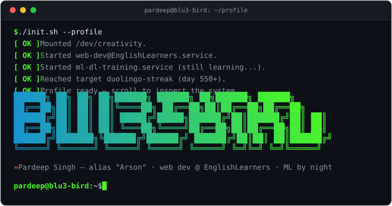
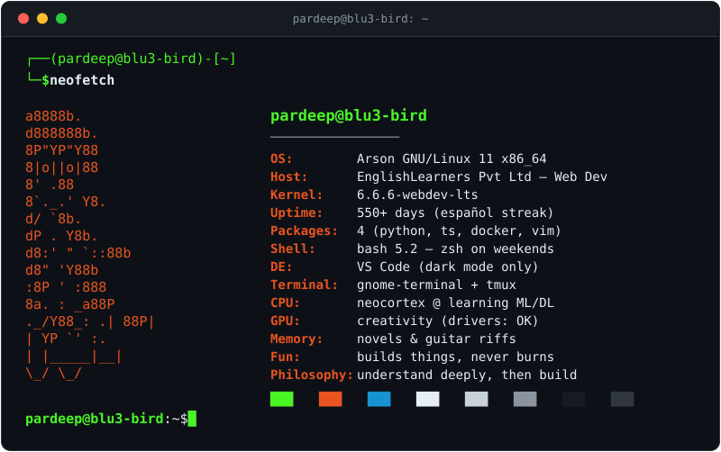
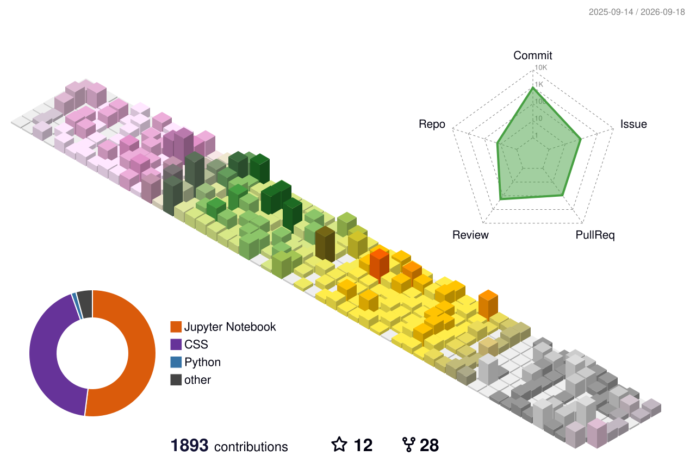
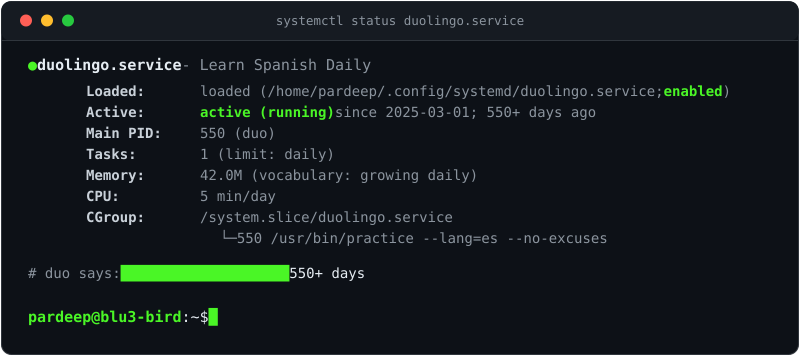

  

---

### `┌──(pardeep🐧blu3-bird)-[~]`
### `└─$ whoami`

  

### `┌──(pardeep🐧blu3-bird)-[/var/log]`
### `└─$ tail -f life.log`

  

### `┌──(pardeep🐧blu3-bird)-[~/stack]`
### `└─$ ls -la`

  

### `┌──(pardeep🐧blu3-bird)-[~/stats]`
### `└─$ htop --github`

  
  

  

  

### `┌──(pardeep🐧blu3-bird)-[~/trophies]`
### `└─$ cat achievements.log`

  

  <picture>
    <source media="(prefers-color-scheme: dark)" srcset="profile-3d-contrib/profile-green-animate.svg"/>
    <source media="(prefers-color-scheme: light)" srcset="profile-3d-contrib/profile-south-season-animate.svg"/>
    
  </picture>

### `┌──(pardeep🐧blu3-bird)-[~/habits]`
### `└─$ systemctl status duolingo.service`

  
    
  
    
  

### `┌──(pardeep🐧blu3-bird)-[~/contrib]`
### `└─$ python3 snake.py`

  <picture>
    <source media="(prefers-color-scheme: dark)" srcset="https://raw.githubusercontent.com/blu3-bird/blu3-bird/output/snake-dark.svg"/>
    <source media="(prefers-color-scheme: light)" srcset="https://raw.githubusercontent.com/blu3-bird/blu3-bird/output/snake.svg"/>
    
  </picture>

---

### `┌──(visitor@git)-[~]`
### `└─$ ssh pardeep@blu3-bird`

  
  &nbsp;
  
  &nbsp;
  
  &nbsp;
  
  &nbsp;
  

  

  

  <code>$ echo $FUN_FACT</code> 
  <i>"I go by <b>Arson</b> online — building things, not burning them! 🔥"</i>

  <code>logout</code> — connection to <b>blu3-bird</b> closed · <code>exit 0</code>

<i>Made with 🐧, ❤️, Python &amp; <code>vim</code> — <code>:wq</code></i>

